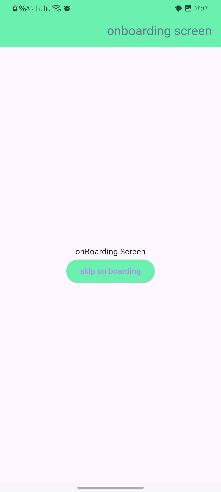

# AppStarter

AppStarter is a Flutter project template designed to accelerate the development of new applications by providing essential features and configurations out of the box.

## Key Features

- **Efficient Navigation**: Customizable routing and bottom navigation for seamless user experience.
- **Theming**: Easy customization of app themes with caching and state persistence.
- **Localization**: Simplified setup for managing app language with caching and state persistence.
- **Icon Generation**: Automatic generation of app icons for Android 12+ and older versions.
- **Splash Screen Generation**: Creation of native splash screens for Android 12+ and older versions.
- **State Management**: Hydrated Cubit for managing app states with persistence and caching.
- **User Modes**: Support for guest and user modes with seamless switching.

## Getting Started

To use AppStarter in your Flutter project, integrate it and start building your app with enhanced productivity and functionality.

## Contributing

Contributions are welcome! Please feel free to open issues or submit pull requests on [GitHub](httpsgithub.commohamedebrahim7App-Starter).

## License

This project is licensed under the MIT License. See the [LICENSE](LICENSE) file for details.

## Screenshots

| Android 12+ Launcher Icon        | Older Android Versions Launcher Icon       |
|:-------------------------:|:-------------------------:|
|   |   |

| Android 12+ Native Splash Screen       | Older Android Versions Native Splash Screen      |
|:-------------------------:|:-------------------------:|
|   |   |

| Onboarding Screen This onboarding screen introduces new users to the app's features. It is shown only once upon the first launch.            | The login screen offers options for logging in as a user with full access or as a guest with restricted functionality.       |
|:-------------------------:|:-------------------------:|
|   |   |

| Localization  and   Theming   |    Localization and Theming	   |
|:-------------------------:|:-------------------------:|
|   |   |

| Restricted Access Screen        | Localized Packaged Screen Fully self-contained with built-in localization for seamless multilingual interaction. |
|:-------------------------:|:-------------------------:|
|   |   |

